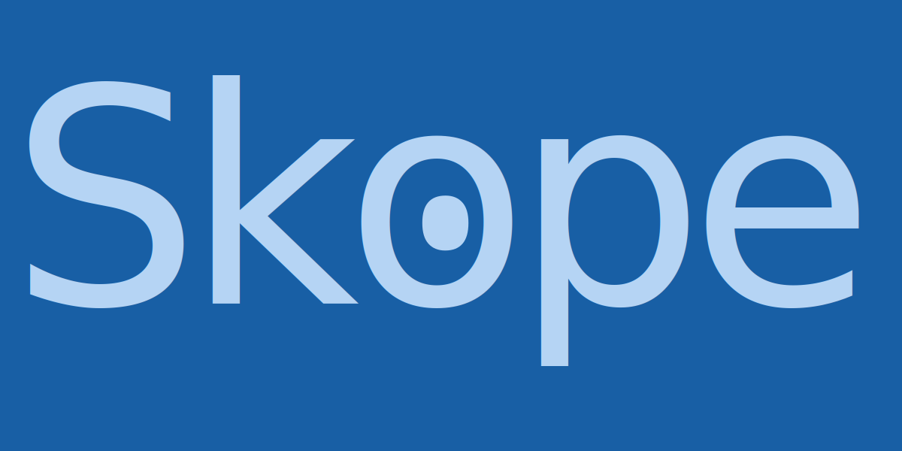

# Skope — Branding Guide

> *skopéō* (σκοπέω) — to look at carefully, to fix one's eyes upon, to observe with intention.

Skope is an open-source dashboard app for Planning Center data. The brand balances modern SaaS clarity with warmth rooted in ministry context. The name derives from the Greek *skopéō* (σκοπέω) — to observe carefully and with intention — a word used throughout the New Testament to describe focused, purposeful sight.

[View application mockup](mockup.html)

## Logo

### Wordmark

### Logo/Icon

## Color palette

### Primary — Deep Blue

The core brand color. Conveys trust, clarity, and depth. Used for buttons, links, focus states, and primary UI chrome.

| Swatch | Name | Hex | Usage |
|--------|------|-----|-------|
|  | Blue 50 | `#E6F1FB` | Backgrounds, highlights, hover surfaces |
|  | Blue 100 | `#B5D4F4` | Light fills, disabled states |
|  | Blue 200 | `#85B7EB` | Secondary accents, icon fills |
|  | Blue 400 | `#378ADD` | Mid-tone, chart elements |
|  | Blue 600 | `#185FA5` | **Brand blue** — buttons, links, focus rings |
|  | Blue 800 | `#0C447C` | Dark accents, text on light blue surfaces |
|  | Blue 900 | `#042C53` | Deep navy, dark mode nav, headings |

---

### Secondary — Teal

The warmth accent for ministry context. Represents life, growth, and community. Used for success states, active badges, chart series, and icons.

| Swatch | Name | Hex | Usage |
|--------|------|-----|-------|
|  | Teal 50 | `#E1F5EE` | Success backgrounds, tag surfaces |
|  | Teal 100 | `#9FE1CB` | Light fills |
|  | Teal 200 | `#5DCAA5` | Icon fills, secondary chart series |
|  | Teal 400 | `#1D9E75` | **Teal accent** — badges, chart bars, icons |
|  | Teal 600 | `#0F6E56` | Borders on teal surfaces |
|  | Teal 800 | `#085041` | Text on teal surfaces |
|  | Teal 900 | `#04342C` | Deep teal, dark mode surfaces |

---

### Warmth — Amber

The ministry heartbeat of the palette. Evokes candlelight, warmth, and community. Used sparingly for warnings, callouts, and attention states.

| Swatch | Name | Hex | Usage |
|--------|------|-----|-------|
|  | Amber 50 | `#FAEEDA` | Warning backgrounds, callout surfaces |
|  | Amber 100 | `#FAC775` | Light fills |
|  | Amber 200 | `#EF9F27` | **Amber accent** — highlights, alert icons |
|  | Amber 400 | `#BA7517` | Mid-tone |
|  | Amber 600 | `#854F0B` | Borders on amber surfaces |
|  | Amber 800 | `#633806` | Text on amber surfaces |
|  | Amber 900 | `#412402` | Deep amber, dark mode warning surfaces |

---

### Neutral — Warm Gray

Grounding, human, and approachable. The slightly warm undertone keeps the UI from feeling sterile. Used for page backgrounds, borders, secondary text, and body copy.

| Swatch | Name | Hex | Usage |
|--------|------|-----|-------|
|  | Gray 50 | `#F1EFE8` | Page background (light mode) |
|  | Gray 100 | `#D3D1C7` | Dividers, subtle borders |
|  | Gray 200 | `#B4B2A9` | Disabled text, placeholder text |
|  | Gray 400 | `#888780` | Secondary text, icons |
|  | Gray 600 | `#5F5E5A` | Borders, muted labels |
|  | Gray 800 | `#444441` | Body text (light mode) |
|  | Gray 900 | `#2C2C2A` | Headings, strong text |

---

## Dark mode

Skope launched with a dark-first UI. The dark mode palette is derived from the deep blue and warm gray ramps. Key values:

| Swatch | Role | Hex | Notes |
|--------|------|-----| ----- |
|  | Page background | `#0E1621` | Deep blue-tinted dark |
|  | Surface / card | `#0A1019` | Slightly darker than page bg |
|  | Border | `#1E2D42` | Subtle blue-tinted border |
|  | Body text | `#C8DDF0` | Desaturated light blue — easier on the eyes than pure white |
|  | Muted text | `#4A6A8A` | Mid-range blue-gray |
|  | Brand blue (dark) | `#185FA5` | Same as light mode — holds up well on dark surfaces |
|  | Teal accent (dark) | `#1D9E75` | Same as light mode |
|  | Amber accent (dark) | `#EF9F27` | Same as light mode |

> All CSS should use variables rather than hardcoded values so light mode support can be added in a future release without refactoring.

---

## Typography

### Typefaces

| Role | Font | Notes |
|------|------|-------|
| Logo / branding | [Noto Serif](https://fonts.google.com/noto/specimen/Noto+Serif) | Used only for the wordmark and brand lockups |
| Application UI | [Inter](https://fonts.google.com/specimen/Inter) | All in-app text: headings, body, labels, badges |

Both fonts are available on Google Fonts.

**Weights in use:** 400 (regular) and 500 (medium). Avoid 600 or 700 — they read as heavy against the UI chrome.

**Size scale:**

| Role | Size | Weight |
|------|------|--------|
| Page heading | 22px | 500 |
| Section heading | 18px | 500 |
| Card heading | 16px | 500 |
| Body | 16px | 400 |
| Label / secondary | 13px | 400 |
| Badge / tag | 11–12px | 500 |